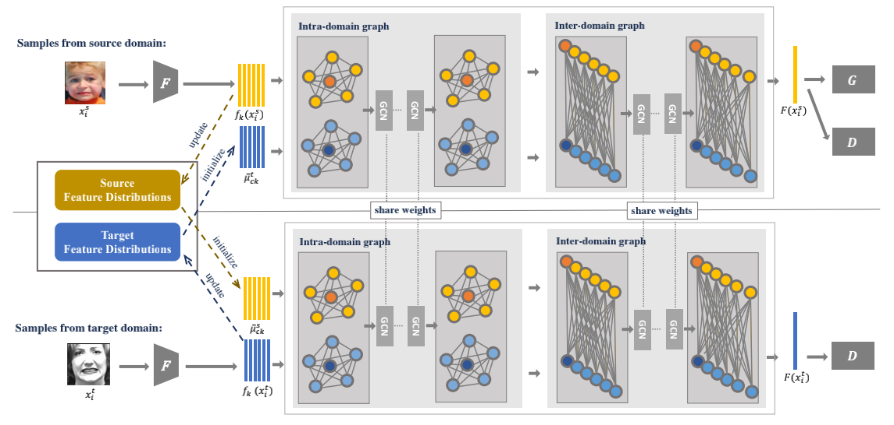

# Adversarial Graph Representation Adaptation for Cross-Domain Facial Expression Recognition

Implementation of papers:   
- [Look into Cross-Domain Facial Expression Recognition: A New Method and Fair Evaluation]   
  Technical Report.   
  Tianshui Chen, Tao Pu, Yuan Xie, Hefeng Wu, Lingbo Liu, Liang Lin.

- [Adversarial Graph Representation Adaptation for Cross-Domain Facial Expression Recognition](https://arxiv.org/abs/2008.00859)   
  ACM International Conference on Multimedia (ACM MM), 2020.   
  Yuan Xie, Tianshui Chen, Tao Pu, Hefeng Wu, Liang Lin.
   



## Environment
Ubuntu 16.04 LTS, Python 3.5, PyTorch 1.3   
PS: We also provide docker image for this project, [click here](https://hub.docker.com/r/putao3/images/tags). (Tag: py3-pytorch1.3-agra)


## Datasets

You can download datasets in [Baidu Drive](https://pan.baidu.com/s/1d8szY1p1Js7gtbgV5Eg04Q) (password: c7xi) and [OneDrive]() (password: xxxx), which includes CK+/SFEW 2.0/FER2013/JAFFE/ExpW/RAF/AFED.   

PS : In order to comply with relevant regulations, you need to apply for the image data of the following data sets by yourself, including CK+/SFEW 2.0/FER2013/JAFFE/ExpW/RAF.

## Pre-Train Model
You can download pre-train models in [Baidu Drive](https://pan.baidu.com/s/1CglPIUGdPrKCkUEmz9pKQQ) (password: tzrf) and [OneDrive]() (password: xxx).   
PS: To replace backbone of each methods, you should modify and run **getPreTrainedModel\_ResNet.py (or getPreTrainedModel\_MobileNet.py)** in the folder where you want to use the method.

## Usage

Before run these script files, you should download datasets and pre-train model, and run **getPreTrainedModel\_ResNet.py (or getPreTrainedModel\_MobileNet.py)**.

### Run AGRA
```bash
cd AGRA
bash TrainOnSourceDomain.sh     # Train Model On Source Domain
bash TransferToTargetDomain.sh  # Then, Transfer Model to Target Domain
```

### Run SAFN
```bash
cd AGRA
bash TrainWithSAFN.sh
```

### Run SWD
```bash
cd SWD
bash Train.sh
```

### Run LPL
```bash
cd LPL
bash Train.sh
```

### Run DETN & ECAN
```bash
cd AGRA
bash TrainOnSourceDomain.sh

# Set Lambda = 1, if you want use ECAN.
# Set Lambda = 0, if you want use DETN.
bash TransferToTargetDomain.sh 
```

### Run FTDNN
```bash
cd FTDNN
bash Train.sh
```

### Run ICID
```bash
cd ICID
bash Train.sh
```

### Run DFA
```bash
cd DFA
bash Train.sh
```

## Result

### Backbone: ResNet-50

#### Souce Domain: RAF

| Methods | CK+ | JAFFE | SFEW2.0 | FER2013 | ExpW | Mean |
| :-: | :-: | :-: | :-: | :-: | :-: | :-: |
| **ICID** | 74.42 | 50.70 | 48.85 | 53.70 | **69.54** | 59.44 |
| **DFA** | 64.26 | 44.44 | 43.07 | 45.79 | 56.86 | 50.88 |
| **LPL** | 74.42 | 53.05 | 48.85 | 55.89 | 66.90 | 59.82 |
| **DETN** | 78.22 | 55.89 | 49.40 | 52.29 | 47.58 | 56.68 |
| **FTDNN** | 79.07 | 52.11 | 47.48 | 55.98 | 67.72 | 60.47 |
| **ECAN** | <u>79.77</u> | 57.28 | 52.29 | 56.46 | 47.37 | 58.63 |
| **CADA** | 72.09 | 52.11 | <u>53.44</u> | <u>57.61</u> | 63.15 | 59.68 |
| **SAFN** | 75.97 | <u>61.03</u> | 52.98 | 55.64 | 64.91 | <u>62.11</u> |
| **SWD** | 75.19 | 54.93 | 52.06 | 55.84 | 68.35 | 61.27 |
| **Ours** | **85.27** | **61.50** | **56.43** | **58.95** | <u>68.50</u> | **66.13** |

#### Souce Domain: AFED

| Methods | CK+ | JAFFE | SFEW2.0 | FER2013 | ExpW | Mean |
| :-: | :-: | :-: | :-: | :-: | :-: | :-: |
| **ICID** | 56.59 | 57.28 | 44.27 | 46.92 | 52.91 | 51.59 |
| **DFA** | 51.86 | 52.70 | 38.03 | 41.93 | 60.12 | 48.93 |
| **LPL** | 73.64 | 61.03 | 49.77 | 49.54 | 55.26 | 57.85 |
| **DETN** | 56.27 | 52.11 | 44.72 | 42.17 | 59.80 | 51.01 |
| **FTDNN** | 61.24 | 57.75 | 47.25 | 46.36 | 52.89 | 53.10 |
| **ECAN** | 58.14 | 56.91 | 46.33 | 46.30 | 61.44 | 53.82 |
| **CADA** | 72.09 | 49.77 | <u>50.92</u> | <u>50.32</u> | <u>61.70</u> | 56.96 |
| **SAFN** | <u>73.64</u> | <u>64.79</u> | 49.08 | 48.89 | 55.69 | <u>58.42</u> |
| **SWD** | 72.09 | 61.50 | 48.85 | 48.83 | 56.22 | 57.50 |
| **Ours** | **78.57** | **65.43** | **51.18** | **51.31** | **62.71** | **61.84** |

---

### Backbone: ResNet-18

#### Souce Domain: RAF

| Methods | CK+ | JAFFE | SFEW2.0 | FER2013 | ExpW | Mean |
| :-: | :-: | :-: | :-: | :-: | :-: | :-: |
| **ICID** | 67.44 | 48.83 | 47.02 | 53.00 | <u>68.52</u> | 56.96 |
| **DFA** | 54.26 | 42.25 | 38.30 | 47.88 | 47.42 | 46.02 |
| **LPL** | 72.87 | 53.99 | 49.31 | 53.61 | 68.35 | 59.63 |  
| **DETN** | 64.19 | 52.11 | 42.25 | 42.01 | 43.92 | 48.90 |
| **FTDNN** | <u>76.74</u> | 50.23 | 49.54 | 53.28 | 68.08 | 59.57 |
| **ECAN** | 66.51 | 52.11 | 48.21 | 50.76 | 48.73 | 53.26 |
| **CADA** | 73.64 | <u>55.40</u> | <u>52.29</u> | <u>54.71</u> | 63.74 | <u>59.96</u> |
| **SAFN** | 68.99 | 49.30 | 50.46 | 53.31 | 68.32 | 58.08 |
| **SWD** | 72.09 | 53.52 | 49.31 | 53.70 | 65.85 | 58.89 |
| **Ours** | **77.52** | **61.03** | **52.75** | **54.94** | **69.70** | **63.19** |

#### Souce Domain: AFED

| Methods | CK+ | JAFFE | SFEW2.0 | FER2013 | ExpW | Mean |
| :-: | :-: | :-: | :-: | :-: | :-: | :-: |
| **ICID** | 54.26 | 51.17 | 47.48 | 46.44 | 54.85 | 50.84 |
| **DFA** | 35.66 | 45.82 | 34.63 | 36.88 | <u>62.53</u> | 43.10 |
| **LPL** | 67.44 | **62.91** | 48.39 | 49.82 | 54.51 | 56.61 |   
| **DETN** | 44.19 | 47.23 | 45.46 | 45.39 | 58.41 | 48.14 |
| **FTDNN** | 58.91 | 59.15 | 47.02 | 48.58 | 55.29 | 53.79 |
| **ECAN** | 44.19 | 60.56 | 43.26 | 46.15 | 62.52 | 51.34 |
| **CADA** | 72.09 | 53.99 | 48.39 | 48.61 | 58.50 | 56.32 |
| **SAFN** | 68.22 | <u>61.50</u> | 50.46 | 50.07 | 55.17 | 57.08 |
| **SWD** | <u>77.52</u> | 59.15 | <u>50.69</u> | <u>51.84</u> | 56.56 | <u>59.15</u> |
| **Ours** | **79.84** | 61.03 | **51.15** | **51.95** | **65.03** | **61.80** |

---

### Backbone: MobileNet V2

#### Souce Domain: RAF

| Methods | CK+ | JAFFE | SFEW2.0 | FER2013 | ExpW | Mean |
| :-: | :-: | :-: | :-: | :-: | :-: | :-: |
| **ICID** | 57.36 | 37.56 | 38.30 | 44.47 | 60.64 | 47.67 |
| **DFA** | 41.86 | 35.21 | 29.36 | 42.36 | 43.66 | 38.49 |
| **LPL** | 59.69 | 40.38 | 40.14 | 50.13 | 62.26 | 50.52 |
| **DETN** | 53.49 | 40.38 | 35.09 | 45.88 | 45.26 | 44.02 |
| **FTDNN** | <u>71.32</u> | 46.01 | <u>45.41</u> | 49.96 | <u>62.87</u> | 55.11 |
| **ECAN** | 53.49 | 43.08 | 35.09 | 45.77 | 45.09 | 44.50 |
| **CADA** | 62.79 | 53.05 | 43.12 | 49.34 | 59.40 | 53.54 |
| **SAFN** | 66.67 | 45.07 | 40.14 | 49.90 | 61.40 | 52.64 |
| **SWD** | 68.22 | <u>55.40</u> | 43.58 | <u>50.30</u> | 60.04 | <u>55.51</u> |
| **Ours** | **72.87** | **55.40** | **45.64** | **51.05** | **63.94** | **57.78** |

#### Souce Domain: AFED

| Methods | CK+ | JAFFE | SFEW2.0 | FER2013 | ExpW | Mean |
| :-: | :-: | :-: | :-: | :-: | :-: | :-: |
| **ICID** | 55.04 | 42.72 | 34.86 | 39.94 | 44.34 | 43.38 |
| **DFA** | 44.19 | 27.70 | 31.88 | 35.95 | 61.55 | 40.25 |  
| **LPL** | 69.77 | 50.23 | 43.35 | 45.57 | 51.63 | 52.11 |
| **DETN** | 57.36 | 54.46 | 32.80 | 44.11 | **64.36** | 50.62 |
| **FTDNN** | 65.12 | 46.01 | <u>46.10</u> | 46.69 | 53.02 | 51.39 |
| **ECAN** | <u>71.32</u> | **56.40** | 37.61 | 45.34 | <u>64.00</u> | <u>54.93</u> |
| **CADA** | 70.54 | 45.07 | 40.14 | 46.72 | 54.93 | 51.48 |
| **SAFN** | 62.79 | 53.99 | 42.66 | 46.61 | 52.65 | 51.74 |
| **SWD** | 64.34 | 53.52 | 44.72 | **50.24** | 55.85 | 53.73 |
| **Ours** | **75.19** | <u>54.46</u> | **47.25** | <u>47.88</u> | 61.10 | **57.18** |

---

### Mean of All Methods

#### Souce Domain: RAF

| Methods | CK+ | JAFFE | SFEW2.0 | FER2013 | ExpW | Mean |
| :-: | :-: | :-: | :-: | :-: | :-: | :-: |
| **ResNet-50** | 75.87 | 54.30 | 54.49 | 54.82 | 62.09 | 59.51 |
| **ResNet-18** | 69.43 | 51.88 | 47.94 | 51.72 | 61.26 | 56.45 |  
| **MobileNet V2** | 60.78 | 45.15 | 39.59 | 47.92 | 56.46 | 49.98 |

#### Souce Domain: AFED

| Methods | CK+ | JAFFE | SFEW2.0 | FER2013 | ExpW | Mean |
| :-: | :-: | :-: | :-: | :-: | :-: | :-: |
| **ResNet-50** | 65.41 | 57.93 | 47.04 | 47.26 | 57.87 | 55.10 |
| **ResNet-18** | 60.23 | 56.25 | 46.95 | 47.57 | 58.34 | 53.87 |
| **MobileNet V2** | 63.57 | 48.46 | 40.14 | 44.91 | 56.34 | 50.68 |

## Citation
To Be Done.

## Contributing
For any questions, feel free to open an issue or contact us:    

* phoenixsysu@gmail.com
* tianshuichen@gmail.com
* putao537@gmail.com
